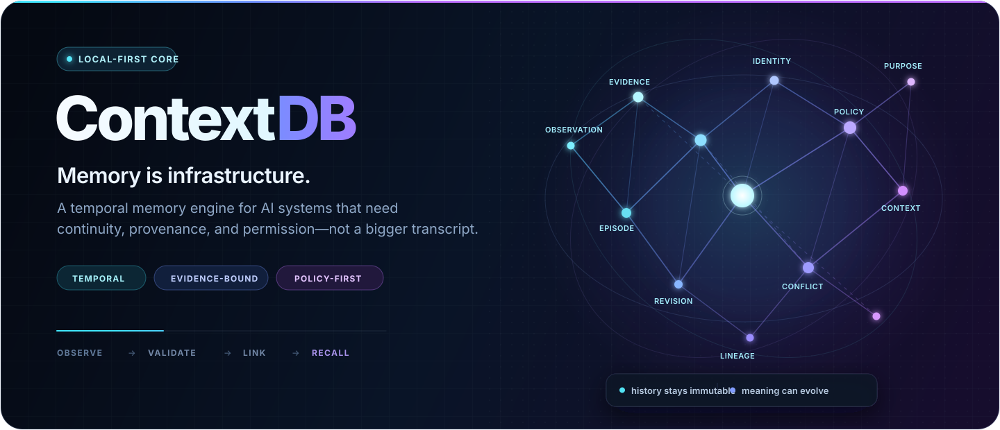
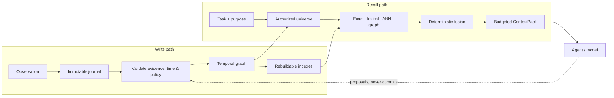
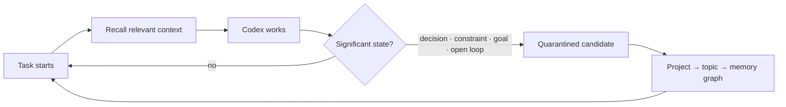

<div align="center">
  

  <br />

  [](https://github.com/mikhailbovt/ContextDB/actions/workflows/ci.yml)
  [](https://github.com/mikhailbovt/ContextDB/releases/tag/v0.2.0-alpha.1)
  [](docs/release/local-mcp-developer-preview.md)
  [](rust-toolchain.toml)
  [](LICENSE)
  [](docs/privacy.md)

  **Durable, explainable memory for AI systems.**<br />
  Immutable experience. Versioned meaning. Policy-first recall.

  [Download preview](https://github.com/mikhailbovt/ContextDB/releases/tag/v0.2.0-alpha.1) · [Get started](#try-the-alpha) · [Architecture](#from-observation-to-context) · [Docs](#documentation) · [Use it with Codex](#give-codex-a-memory)
</div>

> [!IMPORTANT]
> **Current release: `0.2.0-alpha.1`.** Native listener-free local-MCP developer previews are
> available for **Linux x86-64 and Windows x86-64**, each with its own authenticated local
> broker, independently resolved dependency graph, CycloneDX SBOM, and verified package.
> Signed installers, Linux arm64, macOS, and stable production operation are not claimed.
> The exact boundary lives in [Current limitations](docs/limitations.md).

## Context windows end. Context should not.

Most AI “memory” is a transcript, a bag of embeddings, or both. It can find text that looks
similar—but it cannot reliably say *what happened*, *what is believed now*, *why it changed*, or
*whether this caller is allowed to know it*.

ContextDB treats memory as a real system of record:

<table>
  <tr>
    <td width="33%" valign="top">
      <h3>◈ Preserve experience</h3>
      Observations are immutable. Corrections add lineage instead of silently rewriting the
      past, so the system can distinguish history from its current interpretation.
    </td>
    <td width="33%" valign="top">
      <h3>⌁ Evolve meaning</h3>
      Claims, decisions, goals, evidence, conflicts, and revisions live in a typed temporal
      graph—not in anonymous chunks that lose identity over time.
    </td>
    <td width="33%" valign="top">
      <h3>◎ Recall with proof</h3>
      Policy runs before retrieval. The result is a bounded, model-neutral ContextPack with
      provenance, snapshot identity, and explicit disclosure boundaries.
    </td>
  </tr>
</table>

```text
Yesterday:  "Keep the database local-only."       → immutable episode
Today:      local-only is an active constraint     → validated semantic revision
Later:      cloud sync approved for one workspace  → new revision; old evidence survives
Next task:  only the permitted, current constraint → compact ContextPack + trace
```

The model can help extract or rank candidates. It does not get to invent durable truth. Identity,
authorization, temporal semantics, conflicts, supersession, and publication remain deterministic.

## Not a vector database wearing a memory moustache

| Capability | Transcript | Vector-only store | ContextDB |
| --- | :---: | :---: | :---: |
| Stable identity across revisions | — | — | **Yes** |
| Event time *and* knowledge time | — | — | **Bitemporal** |
| Conflicts and supersession | Buried in text | Ad hoc metadata | **First-class** |
| Evidence and provenance | Manual | Optional | **Bound to meaning** |
| Authorization before retrieval | Session-wide | Usually filter-after-search | **Policy-first** |
| Reproducible recall trace | — | Neighbors and scores | **Policy + graph + index + evidence** |
| Model write authority | Host-dependent | Often direct | **Proposal only** |

Vector similarity is useful—it is simply not an epistemology. ContextDB uses exact, lexical,
graph, hierarchy, and ANN routes as bounded ways to find candidates; deterministic semantics
decide what those candidates mean.

## From observation to context



Four boundaries keep the design honest:

1. **The journal and logical graph are authoritative.** Search, hierarchy, and summaries are
   rebuildable projections.
2. **Authorization precedes content access.** Forbidden records cannot influence candidate
   generation, ordering, trace shape, or pagination.
3. **Models propose; deterministic code publishes.** There is one validated mutation boundary.
4. **Recall is snapshot-bound and budgeted.** A ContextPack is the smallest sufficient context,
   not an unbounded prompt dump.

Read the full [architecture overview](docs/architecture/v1-overview.md) or the
[memory concepts guide](docs/memory-concepts.md).

## Try the alpha

The [versioned GitHub prerelease](https://github.com/mikhailbovt/ContextDB/releases/tag/v0.2.0-alpha.1)
contains independently verified listener-free packages for **Linux x86-64** and **Windows x86-64**.
Each target includes a native standalone executable, SHA-256 sidecars, target-specific dependency
notices, a CycloneDX SBOM, and an exact package receipt. For a one-command installation with automatic
project memory, use [ContextDB Memory for Codex](https://github.com/mikhailbovt/ContextDB-Codex);
the standalone core package is the lower-level integration surface.

| Platform | Standalone executable | Verified package |
| --- | --- | --- |
| Linux x86-64 | `contextdb-linux-x86_64` | `contextdb-local-mcp-0.2.0-alpha.1-linux-x86_64.zip` |
| Windows x86-64 | `contextdb-windows-x86_64.exe` | `contextdb-local-mcp-0.2.0-alpha.1-windows-x86_64.zip` |

Both packages are unsigned developer previews: verify the matching `.sha256` sidecar before use.

### Build the engine from source

Prerequisites: Git and the Rust toolchain pinned in
[`rust-toolchain.toml`](rust-toolchain.toml) (`1.97.1` for this alpha).

```console
git clone https://github.com/mikhailbovt/ContextDB.git
cd ContextDB

cargo run -p contextdb-cli -- version
cargo run -p contextdb-cli -- init --in-memory
cargo test --workspace --all-features
```

Core semantics and tests require no hosted model provider, API key, or network service.

### Verify the local-MCP preview

```console
python tools/local-mcp-preview/local_mcp_preview.py verify
```

The verifier automatically selects the current Linux or Windows x86-64 profile. It checks the
target-specific Cargo feature graph, binary identity, MCP protocol surface, disabled network
listeners, dependency notices, and package contract. Packaging and platform-specific custody
details are documented in the [local-MCP preview profile](docs/release/local-mcp-developer-preview.md).

> [!NOTE]
> A passing source build is development evidence—not a signed production release. ContextDB
> deliberately distinguishes source presence, package conformance, native runtime proof, and
> publication evidence.

## Give Codex a memory

[**ContextDB Memory for Codex →**](https://github.com/mikhailbovt/ContextDB-Codex) turns the engine
into automatic, local project continuity.



It recalls project context at substantive task start and checkpoints meaningful decisions,
constraints, preferences, milestones, and open loops without requiring a special “remember this”
prompt. Automatic records remain quarantined: a model-facing tool cannot promote its own output
into canonical truth.

## What exists today

| Surface | Alpha state |
| --- | --- |
| Typed identities, bitemporal records, evidence, policy, and deterministic oracle | **Implemented** and conformance-tested |
| Ordered journal, graph, hierarchy, lexical/ANN recall, and ContextPack | **Implemented** |
| Persistent native storage and recovery primitives | **Implemented** for current local profiles |
| CLI, MCP, HTTP/JSON, gRPC, Python, Go, and TypeScript surfaces | **Present**; support depth varies |
| Conversation, knowledge, and coding reference domains | **Implemented** reference verticals |
| Linux x86-64 listener-free local-MCP package | **Native, package-verifiable developer preview** |
| Windows x86-64 listener-free local-MCP package | **Native, package-verifiable developer preview** |
| Authenticated single-owner MCP broker and operator shutdown | **Implemented** on Linux and Windows |
| Signed multi-platform installers and stable update channel | **Not published** |
| Hosted multi-tenant service or cloud synchronization | **Outside the local-first product** |

“Implemented” means the source and its relevant automated contracts exist. It does not mean every
operating system, failure mode, performance shape, or deployment has been certified. See the
[package support matrix](docs/release/package-support.md) for the formal evidence vocabulary.

## Documentation

<table>
  <tr>
    <td width="33%" valign="top">
      <h3>Understand</h3>
      <a href="docs/memory-concepts.md">Memory concepts</a><br />
      <a href="docs/data-model.md">Data model</a><br />
      <a href="docs/architecture/v1-overview.md">Architecture</a><br />
      <a href="docs/api/context-pack.md">ContextPack API</a>
    </td>
    <td width="33%" valign="top">
      <h3>Integrate</h3>
      <a href="docs/formats.md">Formats</a><br />
      <a href="docs/api/compatibility.md">Compatibility</a><br />
      <a href="docs/integrations/conversation.md">Conversation memory</a><br />
      <a href="sdk/README.md">SDKs</a>
    </td>
    <td width="33%" valign="top">
      <h3>Operate safely</h3>
      <a href="docs/privacy.md">Privacy model</a><br />
      <a href="docs/security/threat-model.md">Threat model</a><br />
      <a href="docs/operations/backup-restore.md">Backup & restore</a><br />
      <a href="docs/limitations.md">Current limitations</a>
    </td>
  </tr>
</table>

The complete navigation lives in the [documentation map](docs/README.md).

<details>
<summary><strong>Repository map</strong></summary>

- `crates/contextdb-core` — model-neutral types and invariants.
- `crates/contextdb-reference` — deterministic correctness oracle.
- `crates/contextdb-native-service` — persistent native composition.
- `crates/contextdb-journal`, `contextdb-graph`, `contextdb-index`, `contextdb-recall` — durable
  history and retrieval.
- `crates/contextdb-hierarchy`, `contextdb-context`, `contextdb-continuity` — abstraction,
  ContextPack construction, and handoff/checkpoint contracts.
- `crates/contextdb-security`, `contextdb-secure-store` — policy and local custody primitives.
- `crates/contextdb-cli`, `contextdb-mcp`, `contextdb-server` — operator and host interfaces.
- `sdk/` and `bindings/` — Go, TypeScript, and Python surfaces.
- `assets/schemas/` — machine-readable public contracts.
- `fuzz/` — parser and state-machine fuzz targets.

</details>

## Security and privacy

Memory is sensitive by definition. Treat the archive, external key material, backups, and
anything recalled into a model as separate custody surfaces. Evaluate the alpha with synthetic
or non-critical data first.

Report vulnerabilities privately through [SECURITY.md](SECURITY.md). Never place real memories,
credentials, token keys, or private archives in a public issue.

## Build with us

Bug reports, focused design discussions, reproducible benchmarks, and implementation help are
welcome. Start with [CONTRIBUTING.md](CONTRIBUTING.md) and the
[Code of Conduct](CODE_OF_CONDUCT.md).

If ContextDB saves you from explaining the same repository to an amnesiac machine for the
forty-seventh time, you can support the work through
[GitHub Sponsors](https://github.com/sponsors/mikhailbovt) or
[Ko-fi](https://ko-fi.com/mikhailbovt).

<div align="center">
  <sub>Built for agents that should remember the work—not merely reread it.</sub>
  <br /><br />
  Apache-2.0 · Copyright © Mikhail Bovt and ContextDB contributors
</div>
