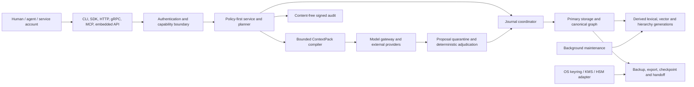

# ContextDB v1 threat model

Status: pre-release; an independent current-source security review remains
required before any formal security gate can pass.

This public threat model is the repository-facing security contract. Internal
planning sources and historical scan material are maintained outside the
public source tree.

This document describes the implementation that is in this repository. It is
not a claim that every deployment or release gate is already certified.

## Security objective

ContextDB must preserve long-lived AI memory without allowing data that is
unauthorized, stale, poisoned, deleted, or merely similar to influence recall,
ranking, summaries, evidence, model calls, or privileged actions. An
acknowledged durable write must survive recovery. A hard deletion must suppress
use immediately and eventually remove every governed derivative.

The principal safety rules are:

1. authorize workspace, actor, agent, subject, purpose, scope, audience, and
   sensitivity before candidate generation or payload materialization;
2. independently authorize raw evidence expansion;
3. treat retrieved content and model output as untrusted data with no tool or
   mutation authority;
4. commit semantic state only through validated, atomic, replay-safe host
   transactions;
5. derive policies conservatively and apply live revocation/deletion overlays
   even to retained snapshots and restored backups;
6. bind continuations, streams, traces, exports, and receipts to exact caller,
   request, snapshot, policy, and format identities;
7. fail closed on corruption, unknown capabilities, ambiguous identity,
   exhausted budgets, and incompatible formats.

## Assets

| Asset | Security property |
| --- | --- |
| observations and primary content | confidentiality, integrity, provenance, deletion |
| claims, typed memory, conflicts, summaries | evidence lineage, revision history, policy non-broadening |
| graph/index/hierarchy generations | snapshot consistency, no unauthorized influence, rebuildability |
| raw evidence and artifacts | independent access control, byte integrity, minimal disclosure |
| actor/agent/subject/workspace identity | non-confusion, authenticated delegation, tenant isolation |
| journal and acknowledged receipts | atomicity, ordering, idempotency, zero acknowledged loss |
| continuation, stream, trace, and capability tokens | authenticity, caller/request binding, expiry/revocation |
| backups, exports, checkpoints, and handoffs | explicit scope, integrity, confidentiality, isolated restore |
| encryption and signing keys | secrecy, separation, rotation, non-persistence in the data directory |
| audit and deletion receipts | content-free accountability, tamper evidence, monotonic completion |
| budgets and availability | bounded CPU, memory, I/O, model spend, snapshots, retries, and queues |

## Principals and identity dimensions

Security decisions keep these dimensions separate:

- **actor** — authenticated caller;
- **agent** — long-lived agent on whose behalf the call executes;
- **subject** — person or entity whose memory is affected;
- **workspace** — tenant boundary;
- **session** — bounded delegation and continuity context;
- **purpose** — allowed use, never inferred from semantic similarity;
- **service account, adapter, model provider, maintainer, administrator, and
  auditor** — distinct principals with independently scoped capabilities.

`RequestContext` is a semantic request description, not authentication.
Network and privileged domain operations require an authenticated context and
resolved capability grants. Legacy local interfaces are compatibility surfaces
and must not be interpreted as anonymous authorization.

## Trust boundaries and data flow

The following crossings are hostile until validated:

| Boundary | Untrusted input | Required controls |
| --- | --- | --- |
| public interfaces → service | bytes, metadata, identities, continuations, archives | bounded decoding, schema/version checks, authentication, capability checks, stable errors, idempotency |
| service → planner/index | query, filters, snapshot, purpose | policy before identity/content lookup, partitioned indexes, exact snapshot/filter binding, bounded work |
| adapters/documents → canonical memory | content, source identity, evidence claims | immutable source bytes, provenance, taint/secret scan, evidence validation, source-family independence |
| model provider → cognition | arbitrary or injected JSON/text | strict schema, request/model/policy digest binding, quarantine, deterministic adjudication, no commit capability |
| stored content → model/tool runtime | prompt-like text | explicit untrusted channel, provider boundary, no instruction/tool authority, preflight plus independent authorization |
| journal → physical stores | frames, receipts, generations | checksum, exact request bytes, atomic publication/outbox, sequence/base checks, deep verify, replay safety |
| maintenance → derived state | compaction/rebuild output | bounded/preemptible work, source watermark, manifest digest, atomic generation switch, oracle comparison |
| archive/handoff → recipient | encrypted or serialized memory | export capability, explicit source set, signature/AEAD, expiry/revocation, isolated empty-target restore |
| deployment → key material | encryption/signing/token keys | external key source, separation and rotation; never plaintext beside ContextDB data |

## Threat register

| ID | Threat and abuse case | Required mitigation | Current evidence or release disposition |
| --- | --- | --- | --- |
| T01 | cross-workspace, cross-subject, audience, scope, or purpose disclosure | partitioned policy indexes and authorization before candidates/materialization | reference workspace indexes, exact import rebuild/verification, graph/recall/context isolation tests; BENCH-G; deployment proof pending |
| T02 | forbidden records alter counts, candidate sets, ranks, summaries, or timing | absent-versus-denied non-influence oracle and no-touch instrumentation | caller-facing typed reads collapse absent/tombstoned/wrong-family/denied; cross-tenant result/metadata non-influence tests; platform timing review pending |
| T03 | actor/agent/subject confused deputy or forged delegation | authenticated caller wrapper, capability grants, exact identity binding, audit | legacy unary/stream Observe enforces one server-derived same-subject private policy template; network identity deployment proof pending |
| T04 | prompt injection in documents, memories, summaries, or tool output | taint labels, trusted-control/untrusted-data separation, no tool authority, proposal quarantine | security/context/model/cognition adversarial tests |
| T05 | memory poisoning through repetition, mirrors, false preferences, or summary capture | source-family deduplication, conservative promotion, conflict preservation, correction/retraction, anomaly bounds | cognition/knowledge tests; empirical attack corpus remains release evidence |
| T06 | false entity merge or cross-workspace identity collision | scope-aware deterministic identities, referential checks, ambiguity quarantine, reversible history | core/graph/cognition tests |
| T07 | secret reaches persistence, embedding, summary, trace, or provider | bounded secret scanner, default reject, redaction/AEAD/keyed-digest/opaque-vault forms, no public plaintext verifier, sensitivity propagation, local-only routing | security/model/context tests; deployment DLP coverage is policy-specific |
| T08 | model output mutates canonical memory directly | provider-neutral proposal schema, evidence gate, deterministic host adjudication, journal-only publication | M9/M10 and journal tests |
| T09 | forged/tampered continuation, stream cursor, trace, or replay key | keyed domain-separated tokens bound to caller/request/snapshot/filter; constant semantic validation | subscription cursors bind authorization plus workspace-local sequence domain; local snapshot ordinals round-trip through an explicit workspace map; secret key sourcing must pass M16 review |
| T10 | partial commit, reordered journal, stale base, lost acknowledgement, or corrupted tail | single coordinator, checksummed frames, exact idempotency digest, Sync barrier, atomic outbox/publication, failpoints | journal tests and native redb process-kill proof |
| T11 | malicious archive, rollback, scope broadening, or restore into live data | canonical digest, signed manifest, AEAD, database/policy/scope/expiry/lineage binding, isolated empty target | security/service/conformance tests; production signing identity pending M18/M19 |
| T12 | incomplete deletion leaves evidence, summaries, indexes, caches, exports, providers, or backups usable | immediate live denial; independent authoritative closure/evidence verifier before signed receipt | security deletion tests and fault report; external provider/backup erasure needs host receipts |
| T13 | revoked consent bypassed through retained snapshot or old backup | database/workspace-bound overlay requires externally anchored signed exact head and dominates historical/restored state | security policy-overlay rollback/domain tests |
| T14 | audit leaks content or can be reordered/truncated | allowlisted content-free fields, chained signatures, independently retained signed-head checkpoint | security audit mutation/reorder/suffix-truncation tests; durable deployment sink pending |
| T15 | DoS via giant input, high-degree graph, frontier flood, retry loop, snapshot retention, or compaction | byte/item/frontier/hop/retry/concurrency quotas; bounded admission decoder and expiring restart-safe leases; backpressure | tenant candidate ceilings and bounded workspace journal pages/sparse subscription scans; admission and per-component budget tests; M17 pressure results pending |
| T16 | compromised dependency, registry substitution, native code, or unsafe Rust | locked/pinned dependencies, source allowlist, RustSec, cargo-deny, SBOM, workspace unsafe forbid | local audit/deny/SBOM green; final regenerated SBOM and platform build provenance pending |
| T17 | external model/provider exfiltration or retention | allowlist, sensitivity/purpose/consent/residency/no-training/no-retention routing, minimization, audit | model gateway tests; real provider contractual enforcement is adapter/deployment evidence |
| T18 | handoff converts private/agent-private memory into shared context | recipient policy before provider, rebuild from authorized source set, independent evidence ACL, expiry/revocation | continuity tests; live revocation registry is external |
| T19 | preflight is mistaken for authority to execute a tool | preflight only supplies memory risk context; tool policy independently authorizes | continuity API and tests; host integration required |
| T20 | sensitive payload enters metrics, errors, logs, or debug output | safe `Debug`, canonical non-content errors, allowlisted low-cardinality telemetry, payload export off | exact caller-facing private-miss error equality and pre-materialization family tests; crate tests and M17 telemetry gate |
| T21 | an operator replaces a live logical archive with an older pre-delete or pre-revocation copy | CLI binds canonical archive path, database identity, commit sequence, exact archive digest and predecessor to an external MACed state head; bootstrap/import are empty-destination only; writes publish a private candidate only after archive/head commit | CLI rollback, path-swap, pending-recovery, concurrent-lock and failed-checkpoint tests on Windows and Linux |
| T22 | a crash between KMS creation, ciphertext storage, key-catalog mutation, and head publication creates an orphan key, untracked ciphertext, or falsely published object | preallocate and durably reserve all handles/intent IDs; exact idempotent KMS and atomic object/catalog create-or-get; persist exact head CAS before repository I/O; recover only by monotonic state and reverified real anchor | isolated P4 failpoint/adversarial contract tests; real storage engine, external KMS AEAD, process-kill, and production wiring remain open |

The standalone CLI state-head custodian is part of the trusted computing base.
On Windows it is an exact HKCU authority selected by
`CONTEXTDB_STATE_HEAD_ID`; on Unix it is an owner-only external file selected
by `CONTEXTDB_STATE_HEAD_FILE`. Replaying both a valid old archive and its
matching valid old authority snapshot is not detectable by a MAC. Production
custody must therefore prevent authority rollback (for example through an OS
protected monotonic store or KMS). Same-account registry rollback,
administrator compromise, and power loss below the documented OS durability
contract remain explicit host risks rather than claims hidden behind the
logical archive checksum.

## Cryptographic boundaries

- Backup confidentiality uses XChaCha20-Poly1305 with a canonical authenticated
  database/workspace/policy/key-generation header and fresh OS-random nonce.
- Backup, deletion, and audit integrity use domain-separated Ed25519 signatures.
- Continuation and trace handles use domain-separated keyed digests and are not
  bearer authorization grants.
- Unkeyed plaintext digests are not exposed beside restricted ciphertext;
  digest-only secret policy uses a separately provisioned keyed BLAKE3 role.
- BLAKE3 digests provide integrity and identity, not authenticity where a
  signature or authenticated channel is required.
- Backup encryption keys, database/field keys, signing keys, and continuation
  keys are separate roles. The M16 reference field envelope authenticates its
  database/workspace/record/field/scopes/policy and rotation generation, and
  rewraps only to a distinct newer generation. Production keys must enter through an OS keyring,
  KMS, HSM, or deployment secret adapter and must not be persisted in plaintext
  in the ContextDB data directory.
- Test keys and local signing fixtures demonstrate mechanics only; they are not
  production identities or custody evidence.

## Deployment assumptions

ContextDB does not defend against a fully compromised host kernel, debugger
with process-memory access, or malicious administrator holding all deployment
keys. The security contract still minimizes blast radius through workspace and
capability partitions, content-free audit, key separation, and explicit export.

Service deployments must provide TLS or mTLS termination, trusted identity
resolution, key custody, filesystem/volume protection, process isolation,
backup lifecycle enforcement, clock quality, and resource controls appropriate
to their assurance level. High-assurance tenants may use separate database
directories or processes.

## Known pre-release gaps

These items are fail-closed release blockers or explicit external evidence; they
must not be silently converted into a passed gate:

- the sealed repository security scan is static/offline source-review evidence;
  remediation tests and target-platform gates must remain linked separately and
  do not by themselves prove a production deployment composition;
- final Linux x86_64, Linux arm64, and macOS arm64 sanitizer, install, TLS, and
  recovery evidence is external to this Windows run;
- production key custody, release signing identity, registry attestations, and
  live provider deletion/revocation receipts cannot be proven with local test
  fixtures;
- CLI/server continuation-key provisioning must be reviewed against the rule
  forbidding plaintext keys in the data directory before M16 is closed;
- M17 mixed-pressure, resource, and 10-million-node certification results are
  not implied by unit tests or bounded developer benchmarks.

## Required M16 verification

M16 can pass only when all of the following are linked from immutable proof:

- zero acknowledged loss across failpoints and native restart/kill recovery;
- deep verification and isolated restore;
- complete hard-delete dependency closure and provider/export/backup receipts;
- tenant, scope, audience, purpose, snapshot, and consent non-influence;
- prompt-injection, poisoning, entity-resolution, sensitive-inference, and
  secret suites;
- parser/format fuzz smoke plus target-platform sanitizer evidence;
- dependency audit, source/license policy, final CycloneDX SBOM, and unsafe-code
  review;
- encrypted scoped backup/export tests and key-provisioning review;
- a completed deep scan with every candidate validated, every reportable path
  analyzed, and no unresolved critical or high finding.

The current local artifacts live under `proof/M16`; their individual status and
limitations remain authoritative over this narrative.
